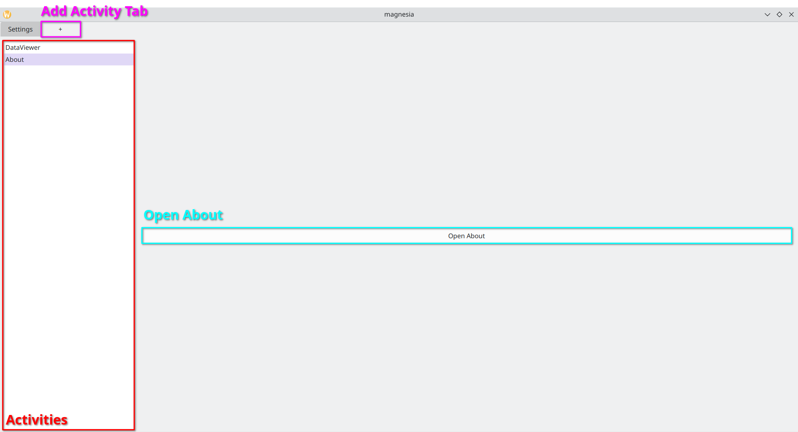
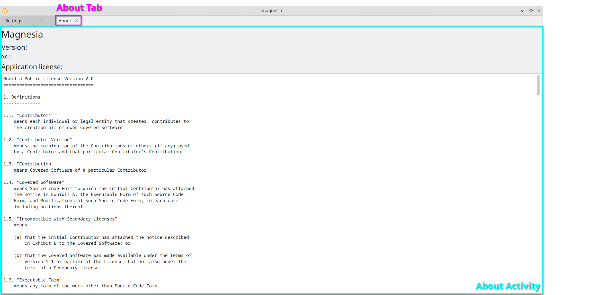

About
======

The :ref:`About Activity <about-activity>` provides an overview of

- the application's version
- a link to the documentation, an issue tracker
- the license of the application
- the used dependencies and their licenses

Open About
-----------
- Click on Add Activity Tab Symbol
- :ref:`Choose Activity About <choose-about>`
- Click on Open About
- :ref:`About Tab opens <about-activity>`

.. _choose-about:

   Choose About

.. _about-activity:

   About