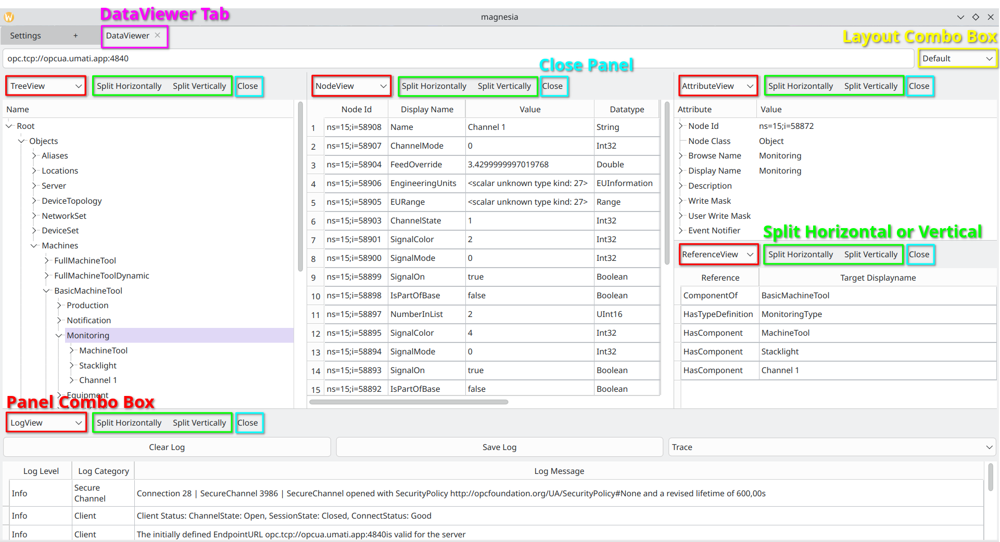
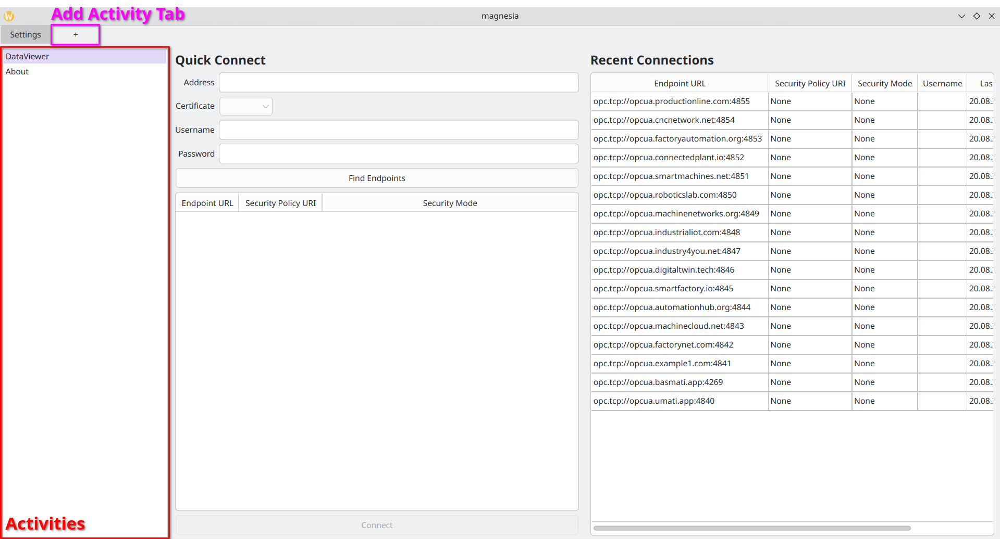
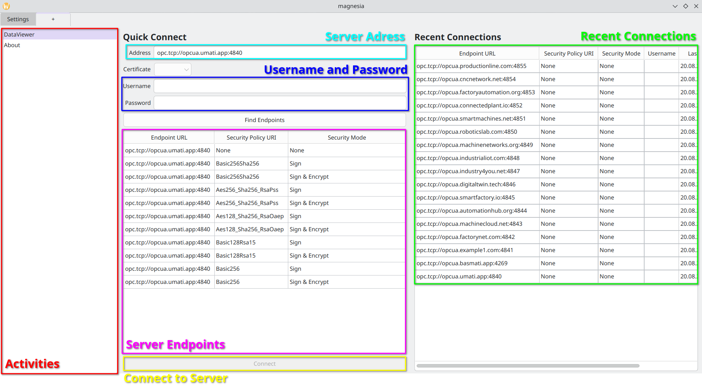
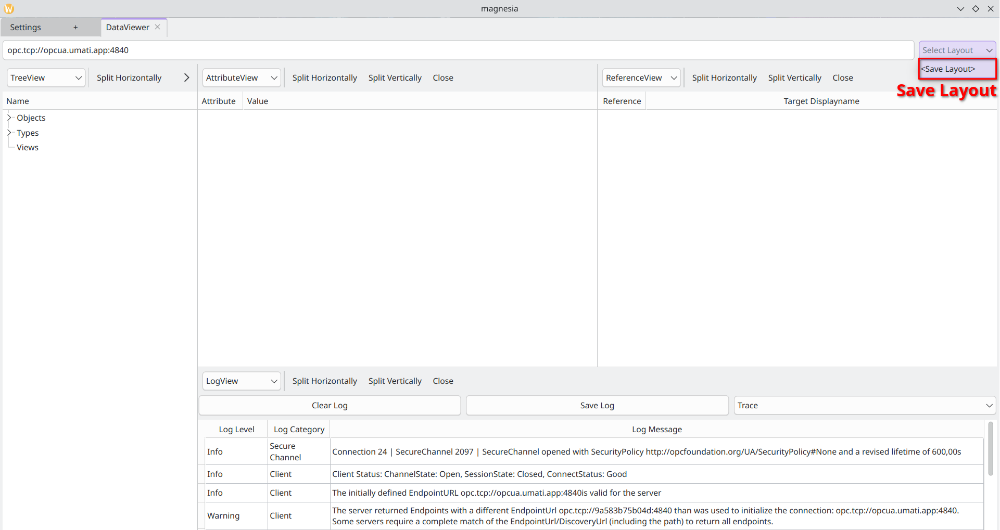
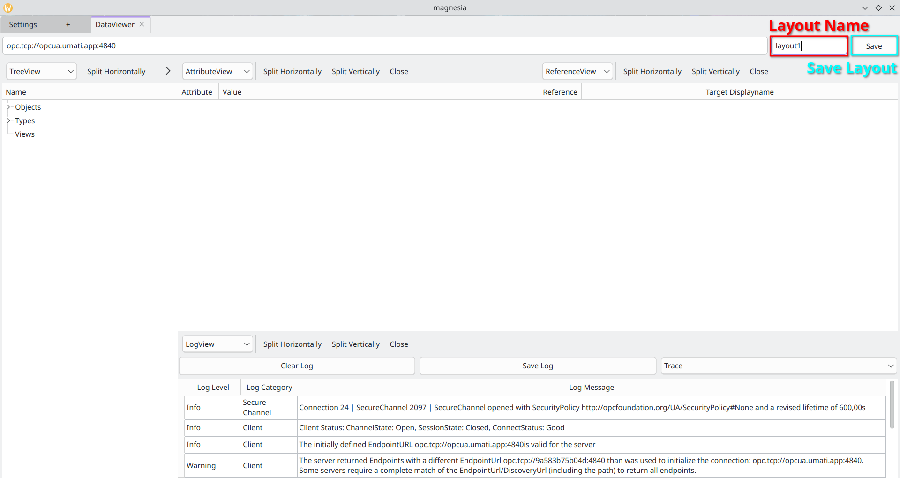
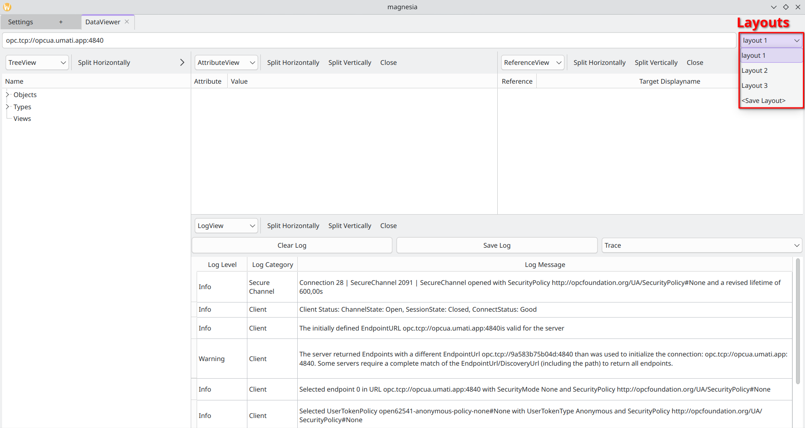

DataViewer
==========

The DataViewer is the main part of the application. It allows the user to interact with the data
provided by an OPC UA connection, i.e., the nodes of a server.

.. _dataviewer-panel:

   DataViewer

.. _create dataviewer activity:

Create new DataViewer Server Connection
-----------------------------------------
- Click on new Activity Tab
- Click on :ref:`DataViewer <quick-connection>`
- Enter Server address
- Click on :ref:`Find Endpoints <find-endpoints>`
- Choose Endpoint
- Username, Password and Certificate is depending on the Connection type needed.
- Click on Connect

.. _quick-connection:

   DataViewer Server Connection

.. _find-endpoints:

   Find Endpoints

.. _dataviewer-recent-connections:

New DataViewer Tab from Recent Connections
-------------------------------------------
- Click on new Activity Tab
- Click on DataViewer
- Double click on an Entry from the :ref:`Recent Connections List <find-endpoints>`
- Or else click (single click) on an Entry from :ref:`Recent Connections List <find-endpoints>`
- Click on Find Endpoints
- Choose Endpoint
- Click on Connect

.. _choose-different-Panel:

Choose a different Panel
------------------------
- Click on the :ref:`Panel Combo Box <dataviewer-panel>`
- Choose a different Panel

.. _add-another-panel:

Add another Panel
------------------
- Click on the :ref:`Split Vertical or Horizontal <dataviewer-panel>` Button, then choose new Panel

.. _remove-panel:

Close an Panel
--------------
- Click on the :ref:`Close <dataviewer-panel>` Button.

.. _resize-panel:

Change size of an Panel
------------------------
- Drag the border of the Panel with the mouse cursor

.. _save-Layout:

Save  Layout
-------------
- Click on the :ref:`Layout Combo Box <dataviewer-panel>`
- Click on :ref:`Save Layout <click_save_layout>`
- Enter the new :ref:`Layout Name <new_layout_name>`
- Click on the Button :ref:`Save <new_layout_name>`

.. _click_save_layout:

   Click on Save Layout

.. _new_layout_name:

   New Layout Name

.. _change-Layout:

Change Layout
-------------
- Click on the :ref:`Layout Combo Box <dataviewer-panel>`
- :ref:`Choose another Layout <choose_layout>`

.. _choose_layout:

   Change Layout

.. _dataviewer panel:

Panel
--------
.. toctree::
    :maxdepth: 1

    treeview
    nodeview
    attributeview
    referenceview
    logview