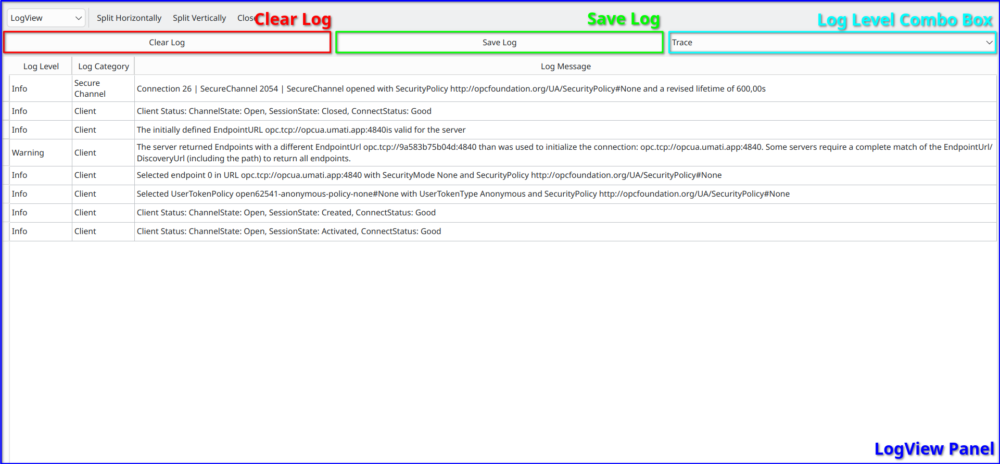

LogView Panel
==============

..

The :ref:`LogView Panel <logview-panel>` displays the log related to the current server connection.
Additionally, a drop-down menu allows you to select different log levels, as well as options to save or clear the current log.

.. _logview-panel:

   LogView Panel

.. rubric:: Change Log Level

- Click on the :ref:`Log Level Combo Box <logview-panel>`
- Choose the Log Level you want to see

.. rubric:: Clear the Log Entries

- Click on the :ref:`Clear Log <logview-panel>` Button

.. rubric:: Save the Log Entries

- Click on the :ref:`Save Log <logview-panel>` Button