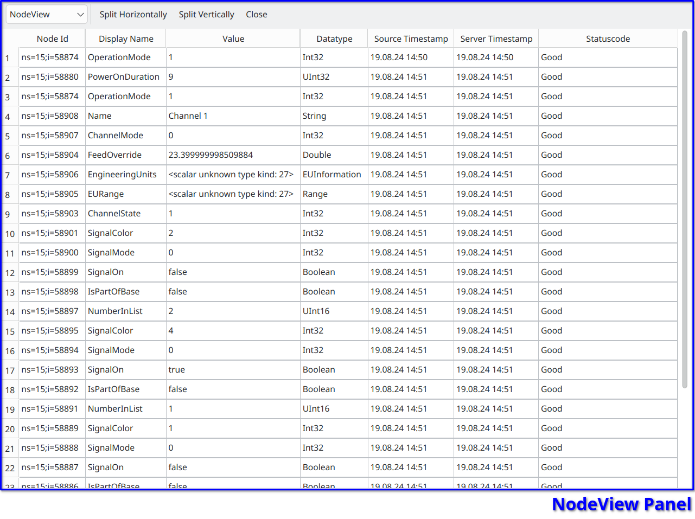

NodeView Panel
===============

..

The :ref:`NodeView Panel <nodeview-panel>` displays all the Leafnodes from the node that have been added from the TreeView, by an double click, in a table format.
This table shows the Node ID, Display Name, Value, Datatype, Source Timestamp, Server Timestamp and Statuscode for each node.

.. _nodeview-panel:

   NodeView Panel