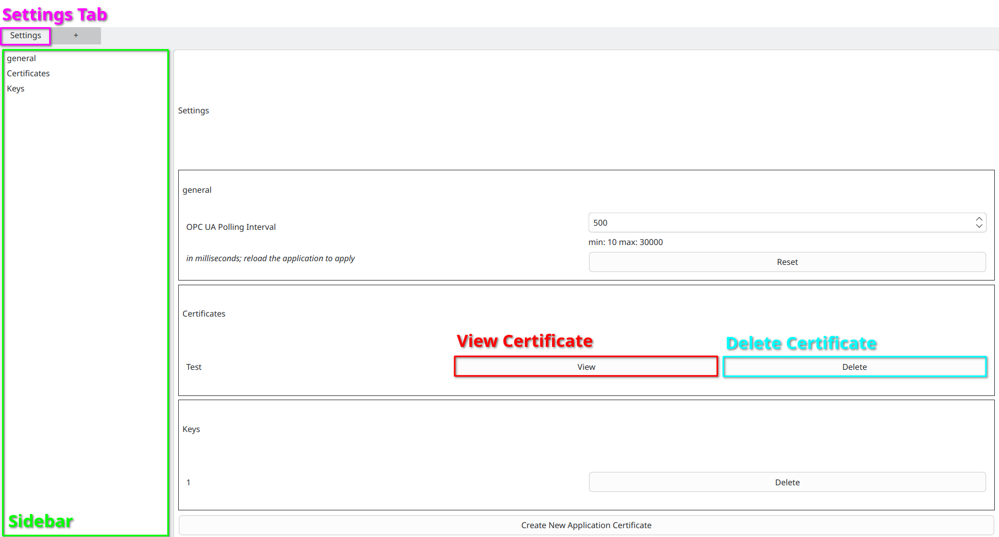
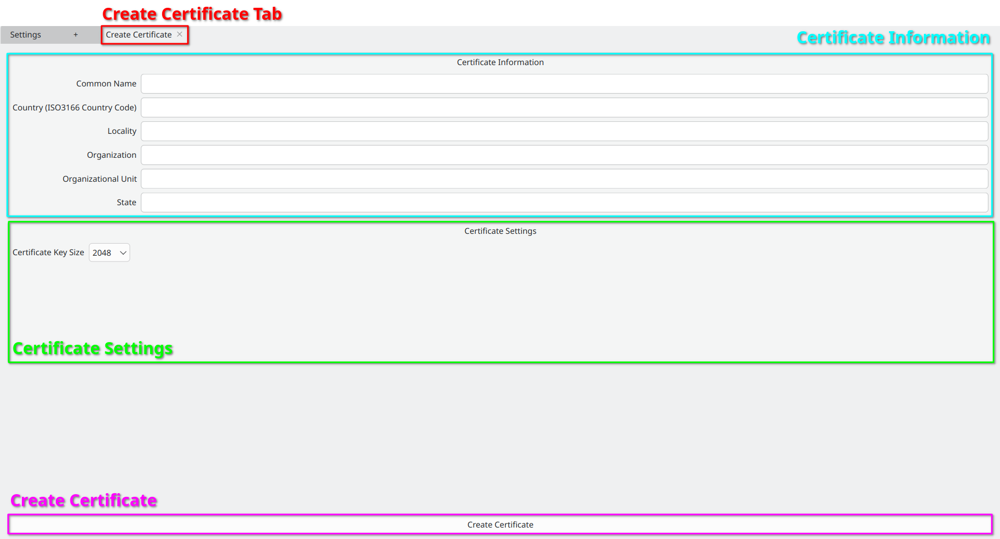
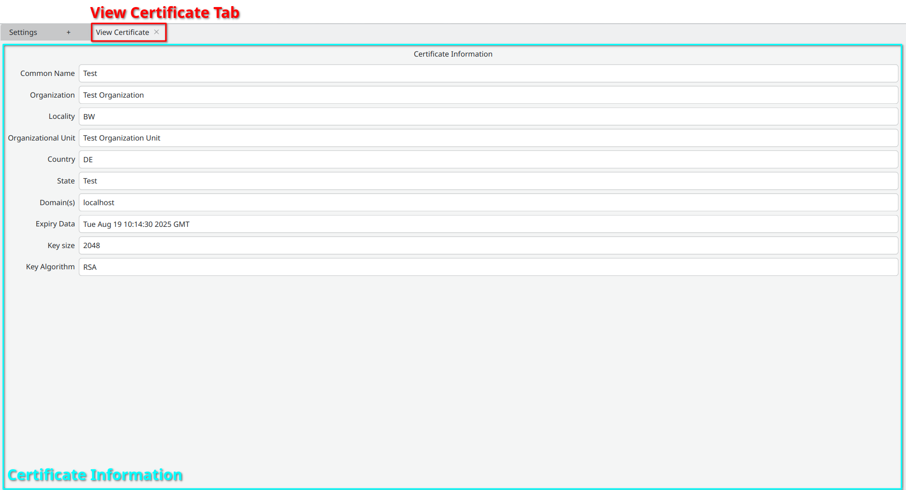

Settings
========

First open the Settings
------------------------
- Click on the :ref:`Settings Tab <settings>`

.. _settings:

   Settings Tab

Navigate in the Settings
----------------------------
- Navigate the Settings by scrolling or using the :ref:`Sidebar <settings>`

.. _general-settings:

General Settings
----------------
- Navigate to the general settings

.. _create-application-certificate:

Create new Certificate
-----------------------
- Navigate to Certificates
- Click on Create New Application Certificate

    - The certificate will be created in the X509v3 format
- Fill out the :ref:`Certificate Information <create-certificate-tab>`

    - Common name is required
    - ISO3166 country code
- Click on Create Certificate

    - Creates a Application Certificate containing an RSA private key
    - An Application Certificate is the combination of a Certificate and it's respective key.

.. _create-certificate-tab:

   Create Certificate

.. _delete-certificate:

Delete Certificate
-------------------
- Navigate to Certificates
- Click on the :ref:`Delete <settings>` Button.

.. _view-certificate:

View Certificate
----------------
- Navigate to Certificates
- Click on the :ref:`View <settings>` Button next to an existing Certificate
- :ref:`View Certificate Tab opens. <certificate-view>`

.. _certificate-view:

   View Certificate