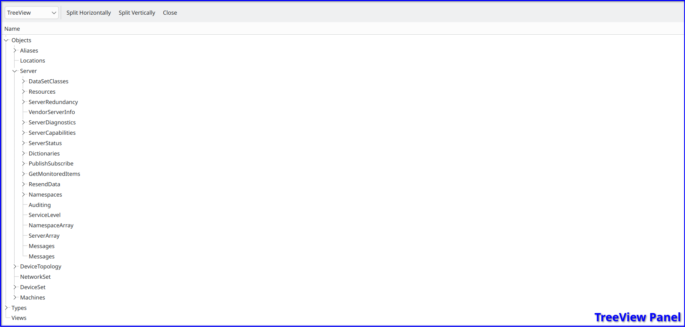

TreeView Panel
==============

..

The Object  :ref:`TreeView Panel <treeview-panel>` displays the hierarchical structure of the nodes on the connected server.
Individual nodes can be expanded or collapsed to show or hide their respective child nodes.
When a user clicks on a node (single click), it will be displayed in the AttributeView, and ReferenceView panels.
If a user double clicks on a node, it will be displayed in the NodeView panel.

.. _treeview-panel:

   TreeView Panel